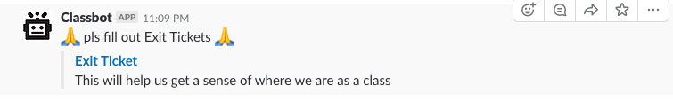

# Exit-ticket Bot 

*🎉🎈🎂🍾🎊🍻💃*

*Automated exit ticket prompt via Slack*

Simple serverless script that will post exit-ticket prompt to slack on lecture days.

The daily portion is achieved with a configured CRON job on [Webtask](https://webtask.io/). This job will invoke a function that POSTs to a [Slack Incoming Webhook](https://api.slack.com/incoming-webhooks). We query slack for channels created on the day of execution (assuming a fresh channel has been started pertaining to contents of current lecture) and based on those channels we further check for a keyword (defaults to `lecture`). Based on members in channels that match the above two criteria, we query for presence and push to another slack channel for measurement.



## [SLACK](https://www.slack.com)

Self explanatory, chatroom tool in use like...a lot. They've great API support! Super developer friendly! Great vehicle for practice content delivery.

## [WEBTASK](https://www.webtask.io)

Javascript focused serverless tool, very easy to configure and deploy. However, it is not meant to be used for more involved applications. Future iterations of this bot may **have** to migrate over to AWS Lambda for this reason.

## BUILDING AND DEPLOYING

There's a few steps required to deploy this script. Ideally, these steps could be made simpler - please submit PRs and ideas/issues around this!

### INSTALLATION

```
$ <git clone repo, cd into it>
$ cd app/
$ npm install
```

Everything is installed locally, so you will have to use `./node_modules/.bin/<script>` to run scripts. Yes, this is annoying. Yes, it is worth the pain.

### INIT WEBTASK

If you don't have webtask CLI already set up, please do so now. **[Setting up Webtask CLI](https://webtask.io/docs/wt-cli)**.

### SECRETS

In order to properly use this script, you will have to supply some scripts. In the `app/` directory you will see a `.secrets.txt.sample`.

First, let's copy it.

```
$ cd app/
$ cp .secrets.txt.sample .secrets.txt
```

Below, please find an explanation of what each key does. **NOTE**: Not all are "secrets" per-se but for now easier to keep all in one place. 

#### SLACK

```
SLACK_WEBHOOK=https://hooks.slack.com/services/XXXXXXXXXXX/XXXXXXXXXXX/XXXXXXXXXXX
TEXT=XXXXXXXX
TITLE=XXXXXXXX
TITLE_LINK=https://XXXXX.XXXXX.XXXXX
TITLE_TEXT=XXXXXXXX
BOT_DAY=tuesday,thursday
```

| SECRET NAME  | SECRET VALUE |
| ------------- | ------------- |
| `SLACK_WEBHOOK` | refers to slack incoming webhooks. Set that up **[here](https://api.slack.com/incoming-webhooks)** |
| `TEXT` | Main text content of slack prompt, supports emoji in the form of *:EMOJI_KEYWORD:* |
| `TITLE` | Title of link |
| `TITLE_LINK` | URL of exit-ticket form |
| `TITLE_TEXT` | URL caption |
| `BOT_DAY` | days to execute bot, time is determined by CRON script |


Above ^ 

* TEXT is ":pray: pls fill out Exit Tickets :pray:"
* TITLE is "EXIT TICKET"
* TITLE_TEXT is "This will help us get a sense of where we are as a class"

### DEPLOY

```
$ cd app/
$ npm run deploy -- -t sample-task -c "50 20 * * *"
```

Where `-c` is defined CRON frequency, `-t` is the name of your task. 

Donezo!

## TODOS

* Better test coverage
* More meaningful tests
* Convert more of the javascript codebase to use webpack generated 'bundle.js'
* Dedicated AWS Lambda / DynamoDB store (ie: migrate off of MyJSON API)

PRs welcome! Please follow guidelines **[here](https://github.com/mottaquikarim/remotecontrol/blob/master/CONTRIBUTE.md)**.

*This project is a **[remotecontrol](https://github.com/mottaquikarim/remotecontrol)** service.*

